# ClinicalPilot

**Multi-agent clinical decision support, powered by MedGemma.**
Specialist AI agents review a case, challenge each other, and produce a structured SOAP note with safety checks and cited evidence.

[](https://www.python.org/downloads/)
[](https://fastapi.tiangolo.com/)
[](https://ollama.com/library/medgemma1.5)
[](https://github.com/BerriAI/litellm)

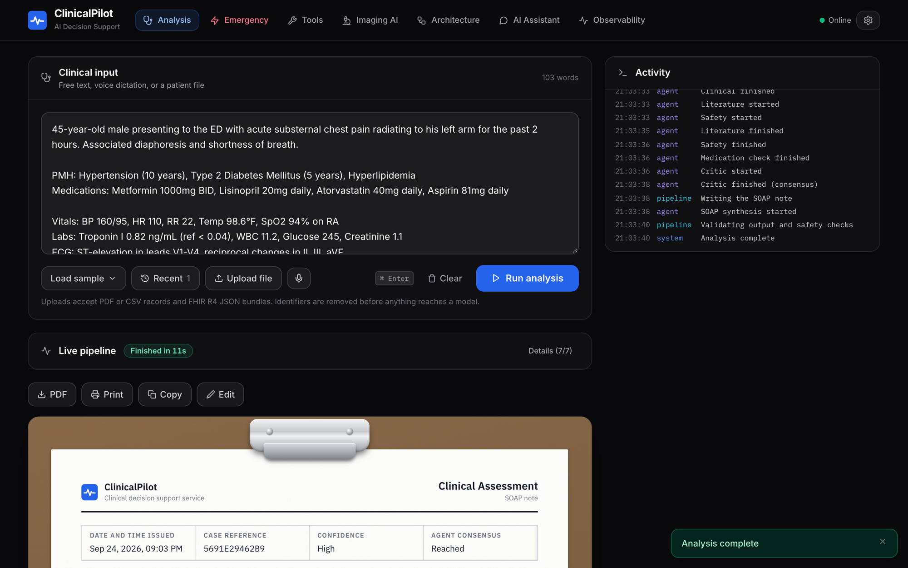

---

## Why this exists

Most clinical AI tools are a single model call behind a long prompt. That is fine for a prototype, not for a patient.

ClinicalPilot routes each case through **specialized agents** (Clinical, Literature and Safety), hands their work to an adversarial **Critic**, and merges the result into a proper **SOAP note** while a **medication error panel** runs in parallel. Every step streams live to the screen and every model call is recorded, so you can see exactly what was asked and what came back.

---

## MedGemma: the model at the centre

[**MedGemma 1.5**](https://ollama.com/library/medgemma1.5) is Google's open medical model, trained for clinical text and reasoning. ClinicalPilot runs it **locally through Ollama**, so patient text never leaves the machine.

- **Clinical reasoning agent.** MedGemma builds the differential diagnosis, risk scores and the first SOAP draft.
- **AI Assistant chat.** Conversational clinical Q&A on the same local model.
- **Reasoning you can watch.** MedGemma 1.5 thinks before it answers. The live pipeline streams that reasoning token by token, labelled *Thinking* and *Answer*, and the final note keeps only the answer.
- **Local-model controls.** Settings shows whether Ollama is running, whether MedGemma is downloaded and whether it is loaded in memory, with one click to load it before the first case.

Every agent is a routing role, so any of them can run on MedGemma, a cloud model, or both with fallbacks.

---

## Features

### Clinical input
Free text, voice dictation, PDF or CSV records, and **FHIR R4** bundles. Built-in sample cases (STEMI, stroke, pulmonary embolism, FHIR bundle, EHR CSV) load in one click. Recent cases are saved in the browser and reopen from the **Recent** menu.

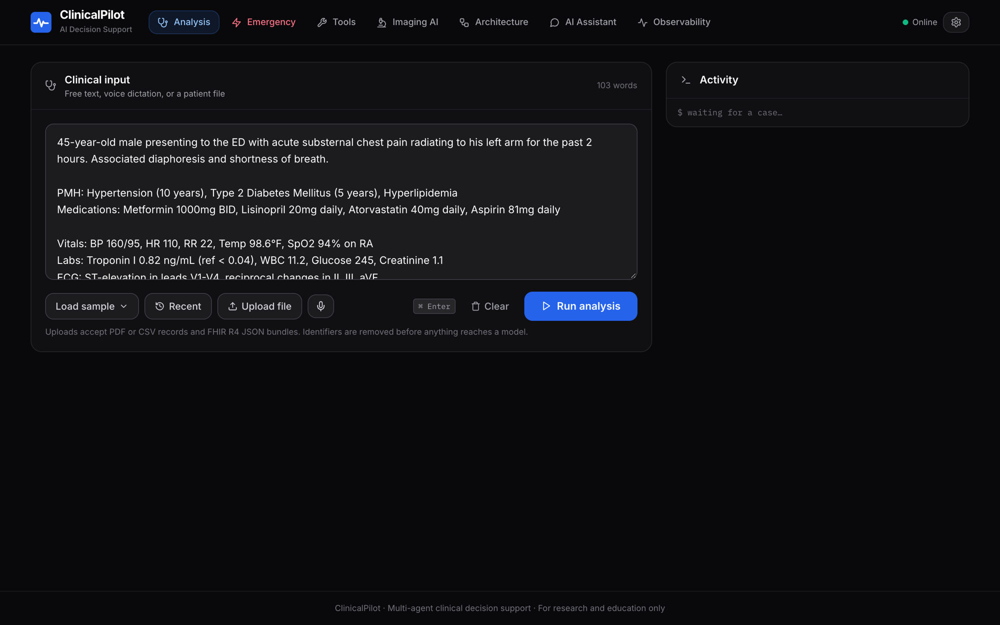

### Live multi-agent pipeline
Watch the real run as it happens: parse and anonymize, Clinical, Literature, Safety, medication check, Critic and SOAP synthesis. Each step shows the engine it runs on, its timing, and its output streaming in live.

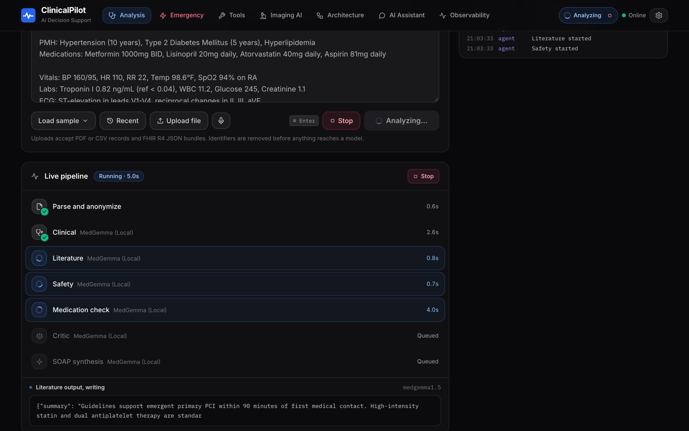

Runs live on the server, not in the tab. Switch pages, refresh, or drop the connection and the page re-attaches to the same run. Stop cancels it at any time. If a step fails, the results from the agents that finished are still shown.

<p align="center">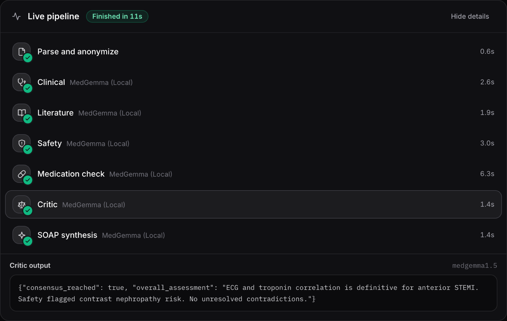</p>

### The SOAP report
A formal clinical document clipped to a clipboard: case details, numbered Subjective, Objective, Assessment and Plan sections, a differential diagnosis table, risk stratification, medication safety, PubMed references, the agents' review summary, and the clinician review status with dates and times. It can be edited in place and exported to PDF, printed or copied.

**[Download the sample SOAP report (PDF)](docs/sample-soap-report.pdf)**

<p align="center">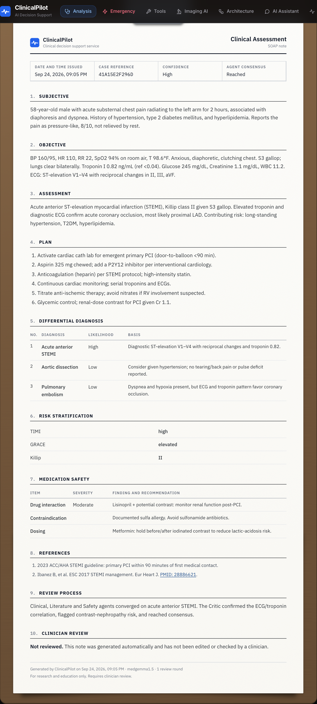</p>

### Doctor feedback loop
Add a correction or missing context and the case goes through a full new review. When it finishes, changed sections are marked *Revised*, with added text highlighted and removed text struck through.

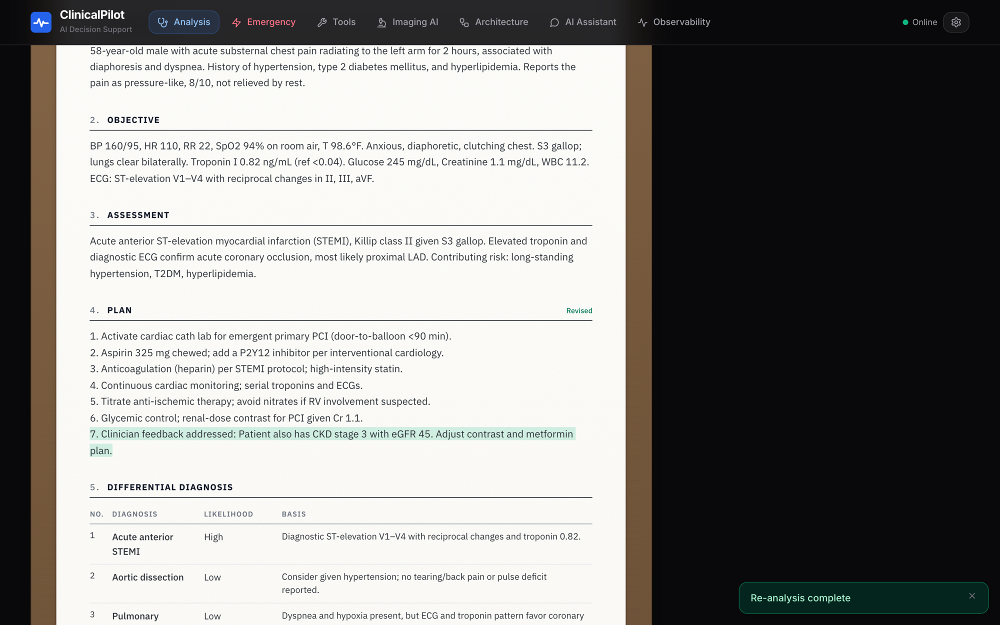

### Emergency triage
A fast path that skips the debate: ESI level, red flags, immediate actions, top differentials and safety notes in seconds.

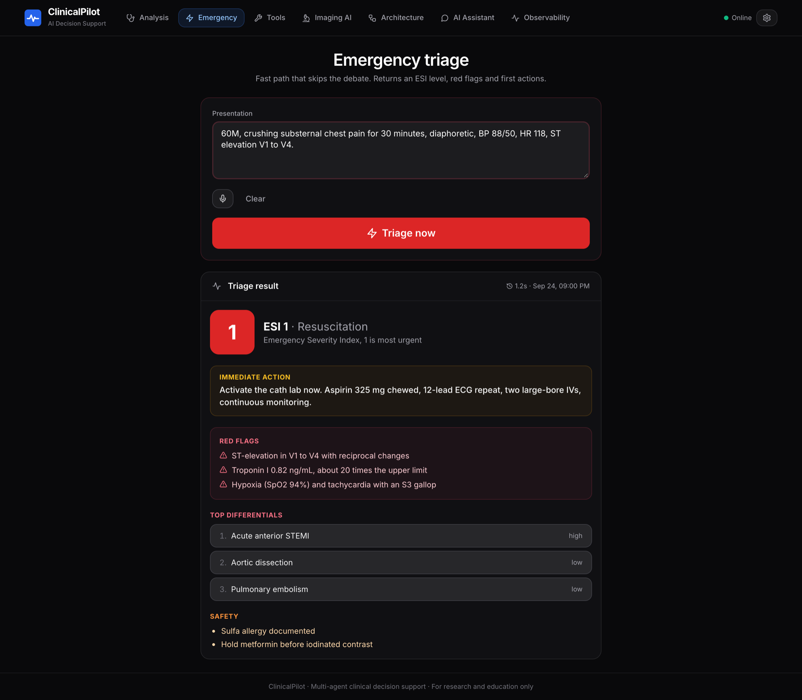

### AI Assistant
Clinical Q&A with formatted answers, suggested starter questions, voice input, and conversation history that survives page switches and refreshes.

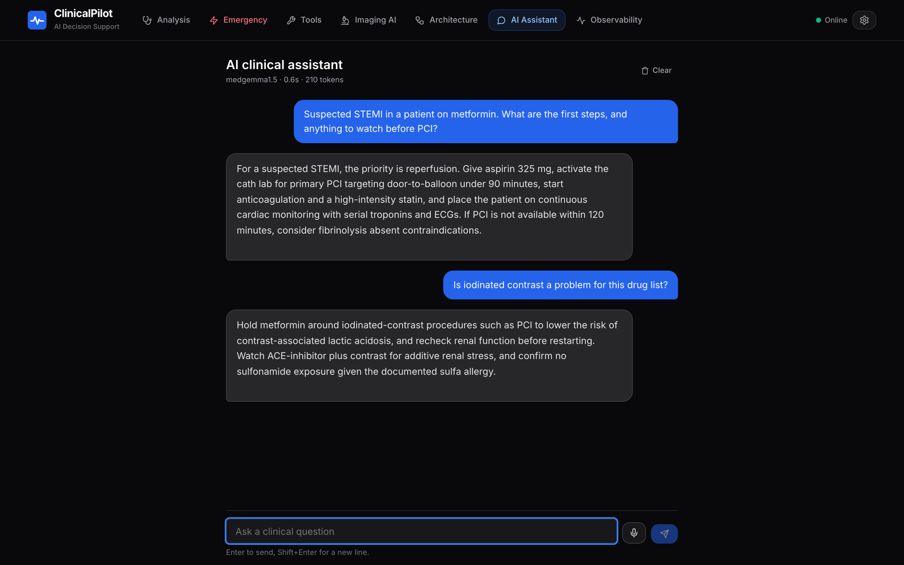

### Clinical tools
A drug interaction checker backed by the medication error panel and DrugBank name checks, bedside calculators (BMI, MAP, Cockcroft-Gault CrCl, anion gap with albumin correction, Bazett QTc), and quick reference ranges.

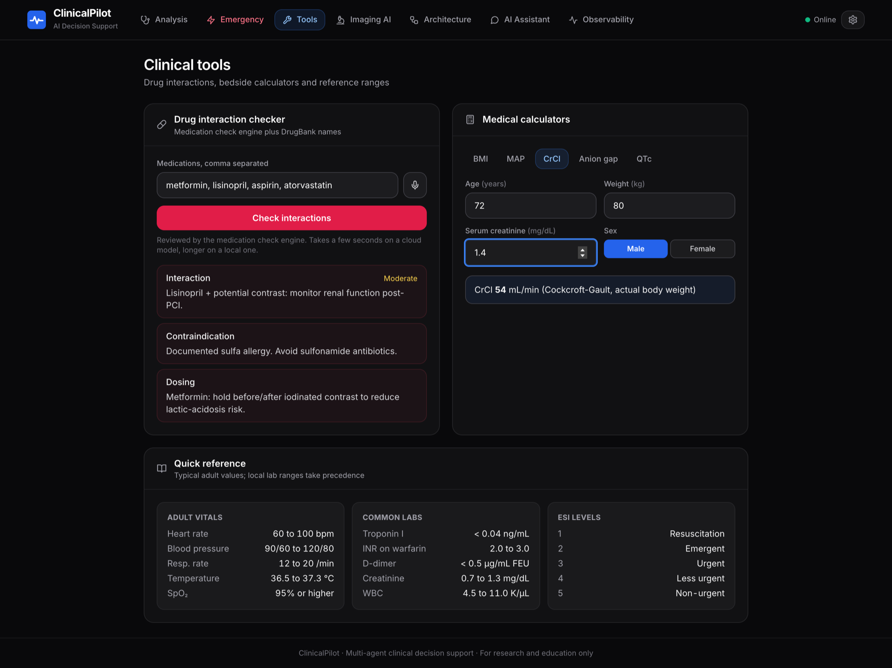

### Imaging AI
Chest X-ray, chest disease, diabetic retinopathy and skin lesion classifiers, embedded or opened in a new tab.

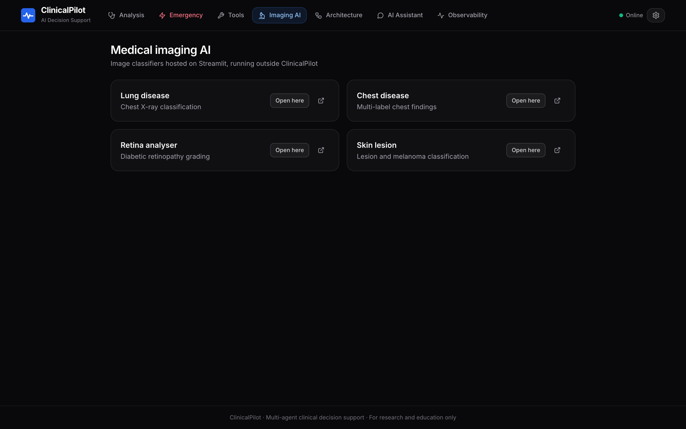

### Observability
Every model call is recorded: agent, engine, model, round, tokens, latency and status. Open any call to read the exact prompt sent, the model's full response, and the PubMed results it used.

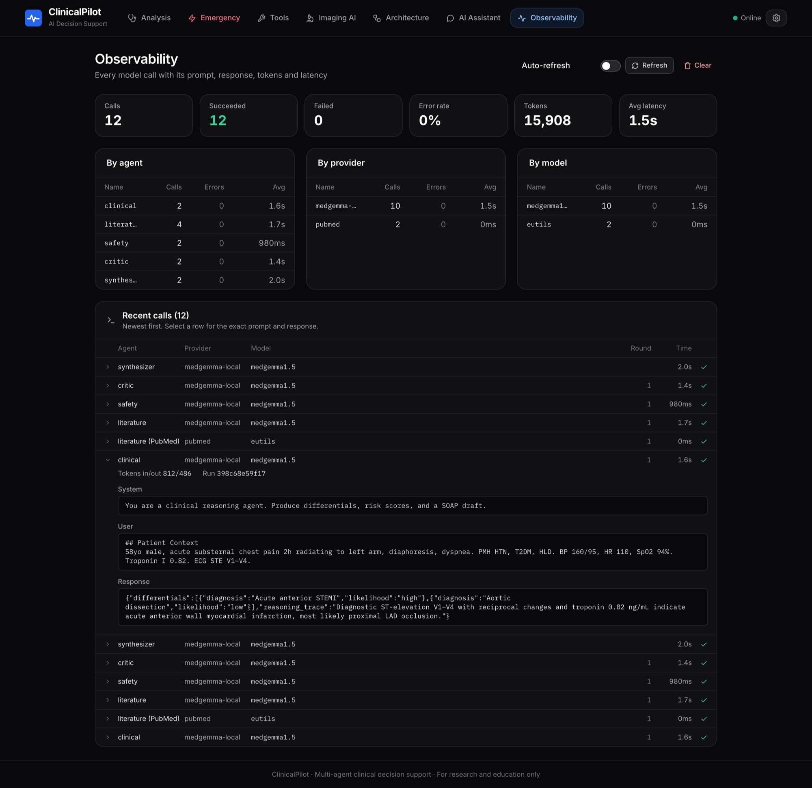

### Settings: engines and routing
Any provider through LiteLLM (Ollama, OpenAI, Groq, Anthropic, Azure or any OpenAI-compatible server). Add engines from presets, find available models, test all engines in one click, and choose which engine each agent uses, with ordered fallbacks and one-click routing setups. Changes apply immediately.

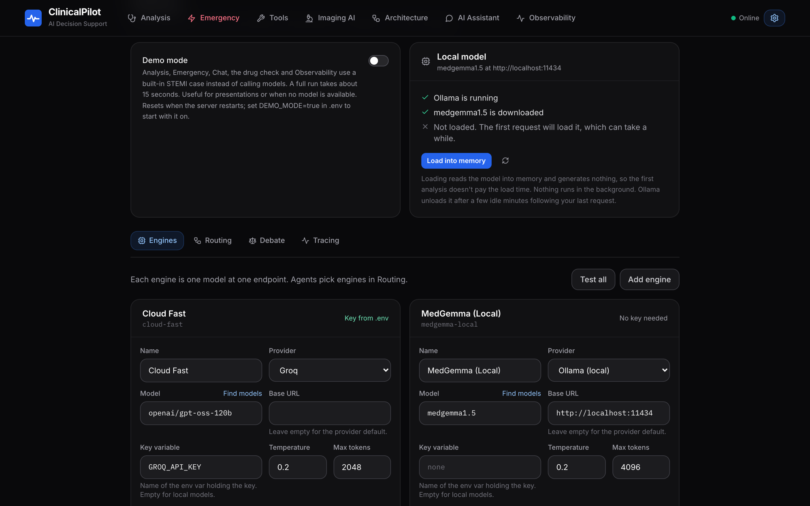
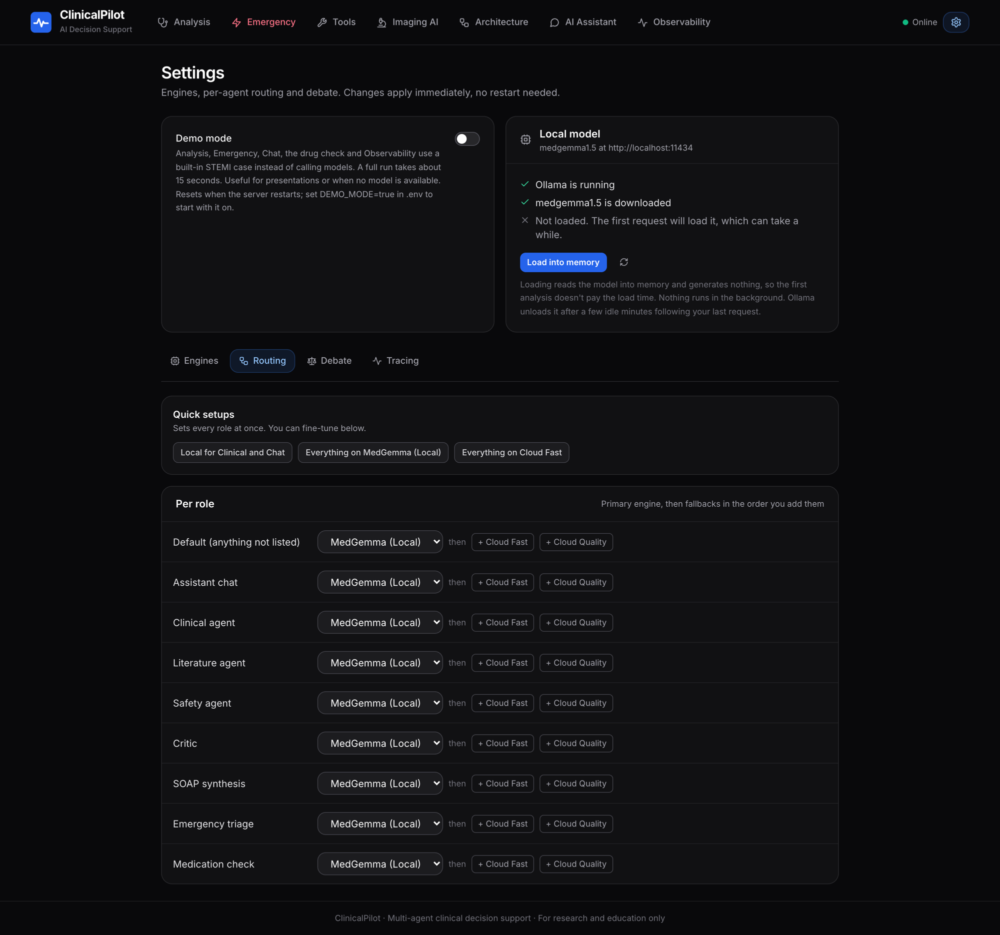

---

## Architecture

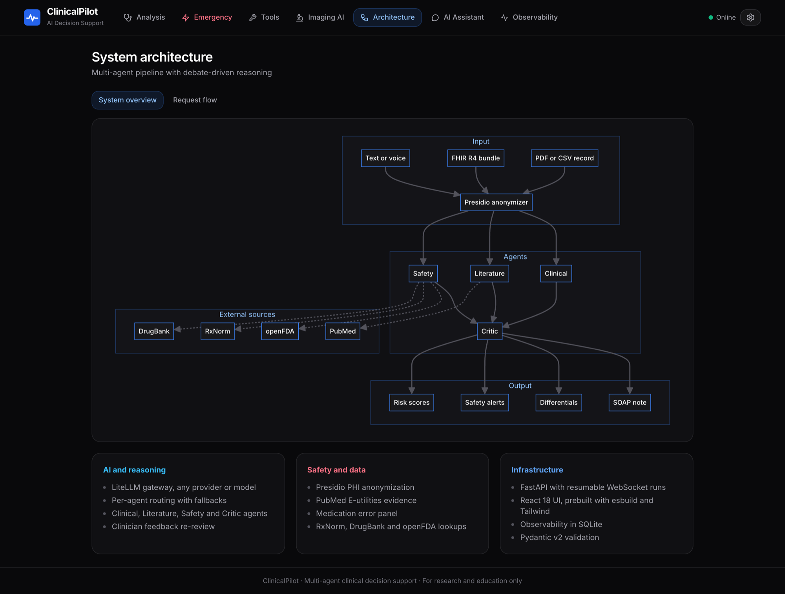

Input from text, voice, FHIR or files is de-identified, then fanned out to the agents. The Critic checks their work against the record, the evidence and the safety findings, and the output layer produces the SOAP note, differentials, safety alerts and risk scores.

## Data pipeline

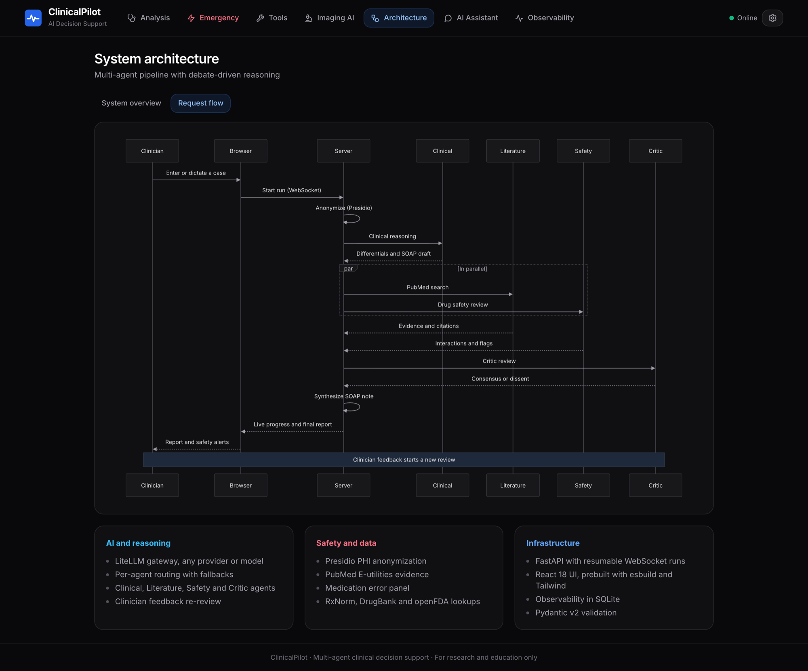

1. **Input.** The browser starts a run over a WebSocket.
2. **De-identification.** Microsoft Presidio removes protected health information before any model sees the text. FHIR bundles are parsed into a single patient record: birth dates become ages, and names and identifiers are never carried over.
3. **Clinical agent (MedGemma).** Differentials, risk scores and a SOAP draft.
4. **Literature and Safety agents in parallel.** PubMed evidence and citations; interactions, contraindications, dosing and population risks from RxNorm, DrugBank and openFDA.
5. **Critic.** Reviews all three for contradictions, evidence gaps and missed safety issues, then decides whether there is consensus. Without consensus the agents revise for another round, up to the limit set in Settings.
6. **Synthesis and validation.** A validated SOAP note, merged with the medication error panel, streamed back to the report.
7. **Clinician feedback.** Corrections start the pipeline again with the note and feedback as context.

Deeper design notes are in [ARCHITECTURE.md](ARCHITECTURE.md).

---

## Built with

| Area | Stack |
|------|-------|
| Medical model | **MedGemma 1.5** via Ollama (local) |
| Model gateway | LiteLLM, with per-agent routing and fallbacks to any provider |
| De-identification | Microsoft Presidio with spaCy (regex fallback) |
| Clinical data | FHIR R4 parser, EHR CSV and PDF parsing, unified PatientContext |
| Evidence and safety | PubMed E-utilities, RxNorm, DrugBank, openFDA |
| Backend | FastAPI, resumable WebSocket runs, Pydantic v2 |
| Observability | SQLite trace store (optional Langfuse and LangSmith) |
| Frontend | React 18, Tailwind, prebuilt with esbuild |

---

## Run it

```bash
git clone <repo-url> && cd clinicalpilot
python -m venv venv && source venv/bin/activate
pip install -r requirements.txt
cp .env.example .env

ollama pull medgemma1.5
python -m uvicorn backend.main:app --port 8000
```

Open **http://localhost:8000**. Engines and keys can also be set from **Settings** in the app. Full setup notes are in [INSTALL.md](INSTALL.md).

<sub>For research and education only. Output requires review by a qualified clinician.</sub>
